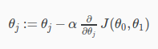

# Week 1

## Supervised vs Unsupervised Learning

### Supervised Learning

> In supervised learning, we are given a data set and already know what our correct output should look like, having the idea that there is a relationship between the input and the output.

Supervised learning problems are categorized into "regression" and "classification" problems. In a regression problem, we are trying to predict results within a continuous output, meaning that we are trying to map input variables to some continuous function. In a classification problem, we are instead trying to predict results in a discrete output. In other words, we are trying to map input variables into discrete categories.

Example 1:

Given data about the size of houses on the real estate market, try to predict their price. Price as a function of size is a continuous output, so this is a regression problem.

We could turn this example into a classification problem by instead making our output about whether the house "sells for more or less than the asking price." Here we are classifying the houses based on price into two discrete categories.

Example 2:

(a) Regression - Given a picture of a person, we have to predict their age on the basis of the given picture

(b) Classification - Given a patient with a tumor, we have to predict whether the tumor is malignant or benign.

### Unsupervised Learning

> Unsupervised learning allows us to approach problems with little or no idea what our results should look like. We can derive structure from data where we don't necessarily know the effect of the variables.

We can derive this structure by clustering the data based on relationships among the variables in the data.

With unsupervised learning there is no feedback based on the prediction results.

Example:

Clustering: Take a collection of 1,000,000 different genes, and find a way to automatically group these genes into groups that are somehow similar or related by different variables, such as lifespan, location, roles, and so on.

Non-clustering: The "Cocktail Party Algorithm", allows you to find structure in a chaotic environment. (i.e. identifying individual voices and music from a mesh of sounds at a cocktail party).

## Model and Cost Function

### Model Representation

To establish notation for future use, we’ll use x(i) to denote the “input” variables (living area in this example), also called input features, and y(i) to denote the “output” or target variable that we are trying to predict (price). A pair (x(i), y(i)) is called a training example, and the dataset that we’ll be using to learn—a list of m training examples(x(i), y(i)); i=1,...,m—is called a training set.We will also use X to denote the space of input values, and Y to denote the space of output values. In this example, X = Y = ℝ.
 
To describe the supervised learning problem slightly more formally, our goal is, given a training set, to learn a function h : X → Y so that h(x) is a “good” predictor for the corresponding value of y. For historical reasons, this function h is called a hypothesis. 

When the target variable that we’re trying to predict is continuous, such as in our housing example, we call the learning problem a <b>regression</b> problem. When y can take on only a small number of discrete values (such as if, given the living area, we wanted to predict if a dwelling is a house or an apartment, say), we call it a <b>classification</b> problem.

### Cost Function

We can measure the accuracy of our hypothesis function by using a cost function. This takes an average difference (actually a fancier version of an average) of all the results of the hypothesis with inputs from x's and the actual output y's.

To break it apart, it is 1/2 * x̄, where x̄ is the mean of the squares of hΘ(xi) - yi, or the difference between the predicted value and the actual value.

This function is otherwise called the "Squared error function", or "Mean squared error". The mean is halved (1/2) as a convenience for the computation of the gradient descent, as the derivative term of the square function will cancel out the 1/2 term.

The goal is to minimize Θ0 and Θ1 so that hΘ(xi) gets as close as possible from the y

## Parameter Learning

### Gradient Descent

Our goal of minimizing the cost function could be better predicted using the gradient function (the direction in which the function will go as low as possible) 

The gradient descent algorithm is as follows:

repeating until convergence:

### Gradient Descent to Linear Regression

When specifically applied to the case of linear regression, a new form of the gradient descent equation can be derived. We can substitute our actual cost function and our actual hypothesis function and modify the equation to :

Here is the derivation of J:

The point of all this is that <b>if we start with a guess for our hypothesis and then repeatedly apply these gradient descent equations, our hypothesis will become more and more accurate</b>.

So, this is simply gradient descent on the original cost function J. This method looks at every example in the entire training set on every step, and is called batch gradient descent. Note that, while gradient descent can be susceptible to local minima in general, the optimization problem we have posed here for linear regression has only one global, and no other local, optima; thus gradient descent always converges (assuming the learning rate α is not too large) to the global minimum. Indeed, J is a convex quadratic function.
