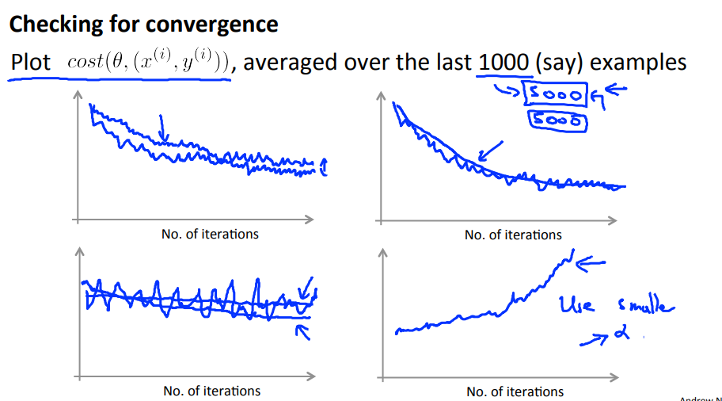

# Large Scale Machine Learning
## Gradient Descent with Large Datasets
### Stochastic Gradient Descent
So far the gradient descent we've used is called **Batch gradient descent** and for calculating the batch gradient we need the whole matrix with every training example in order to minimize θj just one step in direction of the local minimum.

With stochastic gradient descent we try to make it better to take steps more often than with batch gradient:

1. Randomly shuffle dataset (reorder)
2. Repeat 

	for i = 1..m {
	   θj := θj  - α (hθ(x(i)) - y(i)) xj(i))   (for j = 0..n)
	}

Now we have steps much more often, so we can improve our θ just using 1 example for each interaction.

#### Covergence 

The problem is that stochastic gradient descent does not converge the way batch gradient does (always having a smaller cost), instead it will take steps and getting closer and closer to a point (but sometimes cost will improve).

Often is a good idea to plot a chart with the cost after every 1000 interations for example and check if the function is converging.

### Mini-Batch Gradient Descent
So we have some algorithms to calculate gradient:
* **Batch Gradient Descent**: use all *m* examples in each direction
* **Stochastic Gradient Descent**: use 1 example in each direction
* **Mini-Batch Gradient Descent**: use *b* examples in each direction

With mini-batch we're going to take each step calculating for b examples.

For example:

Let's say b = 10 and m = 1000

Repeat: 
for i = 1, 11, 21, ... , 991 {
    		θj := θj  - α 1/10 Σk=i..i+9  (hθ(x(k)) - y(k)) xj(k))   (for j = 0..n)
}

Mini-batch is awesome because we can use **paralelism** to calculate each step.

## Advanced Topics
