# Linear Regression with Multiple Variables

## Multivariate Linear Regression

### Multiple Features

Linear regression with multiple variables is also known as "multivariate linear regression".
We now introduce notation for equations where we can have any number of input variables.

* x(i)j = value of feature j in the ith training example
* x(i) = the input (features) of the ith training example
* m = the number of training examples=the number of features
* n = the number of features

The multivariable form of the hypothesis function accommodating these multiple features is as follows:

hθ(x) = θ0 + θ1x1 + θ2x2 + ... + θnxn

Using the definition of matrix multiplication, our multivariable hypothesis function can be concisely represented as:

### Gradient Descent For Multiple Variables

The gradient descent equation itself is generally the same form; we just have to repeat it for our 'n' features:

In other words:

### Final Formula for Linear Regression

The hypothesis of linear regression is defined as:

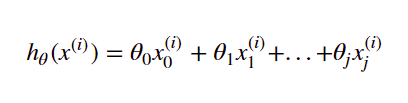

The cost function of linear regression is defined as:

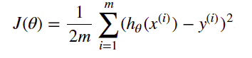

The derivative of cost function to each θ is defined as:

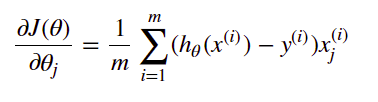

In each iteration of gradient descent, we update all the θ using the following equation:

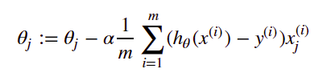

### Gradient Descent in Practice I - Feature Scaling

We can speed up gradient descent by having each of our input values in roughly the same range. This is because θ will descend quickly on small ranges and slowly on large ranges, and so will oscillate inefficiently down to the optimum when the variables are very uneven.

The way to prevent this is to modify the ranges of our input variables so that they are all roughly the same. Ideally:

−1 ≤ x(i) ≤ 1

These aren't exact requirements; we are only trying to speed things up. The goal is to get all input variables into roughly one of these ranges, give or take a few.

Two techniques to help with this are <b>feature scaling</b> and <b>mean normalization</b>. Feature scaling involves dividing the input values by the range (i.e. the maximum value minus the minimum value) of the input variable, resulting in a new range of just 1. Mean normalization involves subtracting the average value for an input variable from the values for that input variable resulting in a new average value for the input variable of just zero. To implement both of these techniques, adjust your input values as shown in this formula:

Where μi is the average of all the values for feature (i) and si is the range of values (max - min), or si is the standard deviation.

### Gradient Descent in Practice II - Learning Rate

Some tips when running gradient descent:

* <b>Debugging gradient descent</b>. Make a plot with number of iterations on the x-axis. Now plot the cost function, J(θ) over the number of iterations of gradient descent. If J(θ) ever increases, then you probably need to decrease α.

* <b>Automatic convergence test</b>. Declare convergence if J(θ) decreases by less than E in one iteration, where E is some small value such as 10−3To summarize:

If α is too small: slow convergence.

If α is too large: may not decrease on every iteration and thus may not converge.. However in practice it's difficult to choose this threshold value.

### Features and Polynomial Regression

We can improve our features and the form of our hypothesis function in a couple different ways.

We can combine multiple features into one. For example, we can combine x1 and x2 into a new feature x3 by taking x1 * x2 

#### Polynomial Regression

Our hypothesis function need not be linear (a straight line) if that does not fit the data well.

We can change the behavior or curve of our hypothesis function by making it a quadratic, cubic or square root function (or any other form).

For example, if our hypothesis function is hθ(x) = θ0 + θ1x1 hen we can create additional features based on x1, to get the quadratic function hθ(x) = θ0 + θ1x1 + θ2x12

## Comparing the Parameters Analytically

### Normal Equation

Gradient descent gives one way of minimizing J. Let’s discuss a second way of doing so, this time performing the minimization explicitly and without resorting to an iterative algorithm. In the "Normal Equation" method, we will minimize J by explicitly taking its derivatives with respect to the θj ’s, and setting them to zero. This allows us to find the optimum theta without iteration. The normal equation formula is given below:

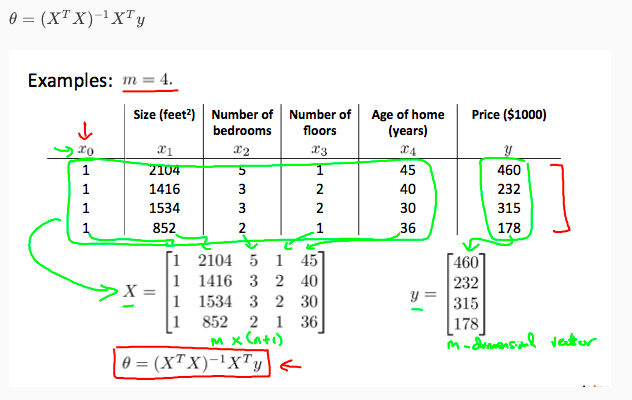

There is no need to do feature scaling with the normal equation.

The following is a comparison of gradient descent and the normal equation:

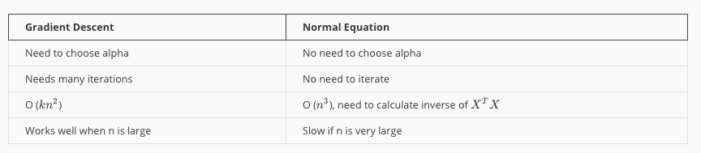

With the normal equation, computing the inversion has complexity <b>O(n3)</b>. So if we have a very large number of features, the normal equation will be slow. In practice, when n exceeds 10,000 it might be a good time to go from a normal solution to an iterative process.

## Vectorization

In order to optimize calculation of linear regression we use vector and matrices that are way faster.

### Hypothesis Implementation

The hypothesis of each sample can be vectorized using following formula:

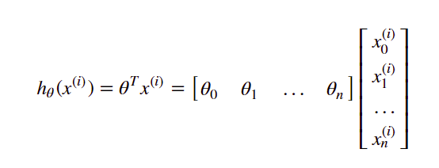

In order to achieve the hypothesis for all the samples as a list, we use the following array dot product:

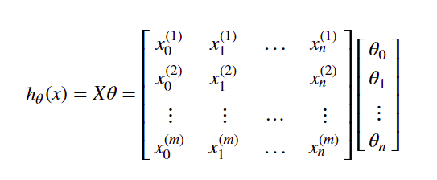

### Cost function Implementation

Based on the vectorization of hypothesis, we can easily vectorize the cost function as:

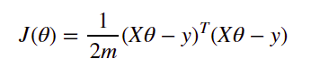

### Derivation Implementation

The derivation of cost function regards to each θ can be vectorized as:

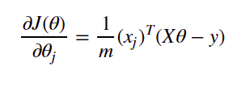

The derivation of cost function to all θ can be vectorized as:

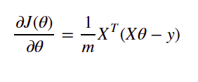
