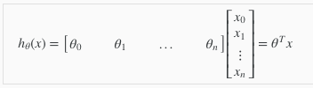
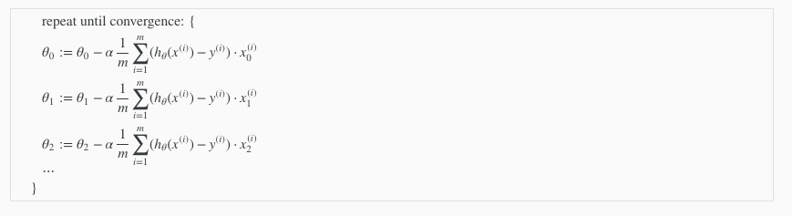
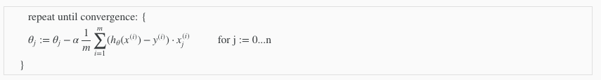
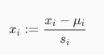

# Week 2

## Multivariate Linear Regression

### Multiple Features

Linear regression with multiple variables is also known as "multivariate linear regression".
We now introduce notation for equations where we can have any number of input variables.

* x(i)j = value of feature j in the ith training example
* x(i) = the input (features) of the ith training example
* m = the number of training examples=the number of features
* n = the number of features

The multivariable form of the hypothesis function accommodating these multiple features is as follows:

hθ(x) = θ0 + θ1x1 + θ2x2 + ... + θnxn

Using the definition of matrix multiplication, our multivariable hypothesis function can be concisely represented as:

## Gradient Descent For Multiple Variables

The gradient descent equation itself is generally the same form; we just have to repeat it for our 'n' features:

In other words:

## Gradient Descent in Practice I - Feature Scaling

We can speed up gradient descent by having each of our input values in roughly the same range. This is because θ will descend quickly on small ranges and slowly on large ranges, and so will oscillate inefficiently down to the optimum when the variables are very uneven.

The way to prevent this is to modify the ranges of our input variables so that they are all roughly the same. Ideally:

−1 ≤ x(i) ≤ 1

These aren't exact requirements; we are only trying to speed things up. The goal is to get all input variables into roughly one of these ranges, give or take a few.

Two techniques to help with this are <b>feature scaling</b> and <b>mean normalization</b>. Feature scaling involves dividing the input values by the range (i.e. the maximum value minus the minimum value) of the input variable, resulting in a new range of just 1. Mean normalization involves subtracting the average value for an input variable from the values for that input variable resulting in a new average value for the input variable of just zero. To implement both of these techniques, adjust your input values as shown in this formula:

Where μi is the average of all the values for feature (i) and si is the range of values (max - min), or si is the standard deviation.

## Gradient Descent in Practice II - Learning Rate

Some tips when running gradient descent:

* <b>Debugging gradient descent</b>. Make a plot with number of iterations on the x-axis. Now plot the cost function, J(θ) over the number of iterations of gradient descent. If J(θ) ever increases, then you probably need to decrease α.

* <b>Automatic convergence test</b>. Declare convergence if J(θ) decreases by less than E in one iteration, where E is some small value such as 10−3To summarize:

If α is too small: slow convergence.

If α is too large: may not decrease on every iteration and thus may not converge.. However in practice it's difficult to choose this threshold value.

