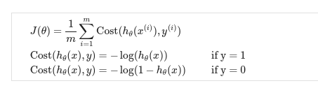
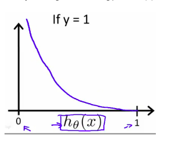
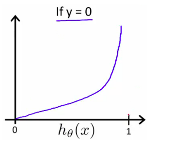
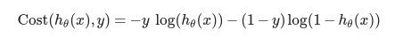
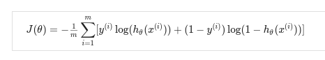
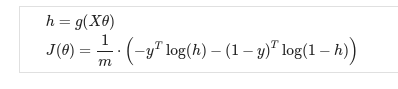
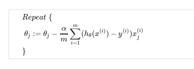
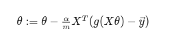
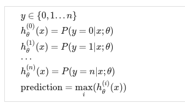
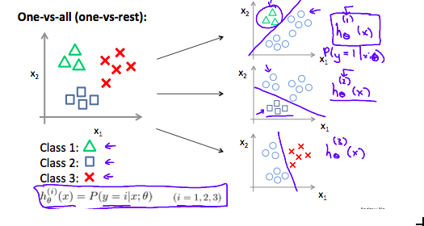

# Week 3

## Classification and Representation

### Classification

The classification problem is just like the regression problem, except that the values we now want to predict take on only a small number of discrete values.

For instance, if we are trying to build a spam classifier for email, then x<sup>(i)</sup> may be some features of a piece of email, and y may be 1 if it is a piece of spam mail, and 0 otherwise. 
Hence, y∈{0,1}. 0 is also called the negative class, and 1 the positive class, and they are sometimes also denoted by the symbols “-” and “+.” 
Given x<sup>(i)</sup>,the corresponding y<sup>(i)</sup> is also called the label for the training example.


### Hypothesis Representation

We could approach the classification problem ignoring the fact that y is discrete-valued, and use our old linear regression algorithm to try to predict y given x. 
However, it is easy to construct examples where this method performs very poorly. 
Intuitively, it also doesn’t make sense for h<sub>θ</sub>(x) to take values larger than 1 or smaller than 0 when we know that y ∈ {0, 1}. 
To fix this, let’s change the form for our hypotheses h<sub>θ</sub>(x) to satisfy <b> 0 <= h<sub>θ</sub>(x) <= 10 </b>.
This is accomplished by plugging θ<sup>T</sup>x into the Logistic Function.

Our new form uses the "Sigmoid Function," also called the "Logistic Function":


The following image shows us what the sigmoid function looks like:


The function g(z), shown here, maps any real number to the (0, 1) interval, 
making it useful for transforming an arbitrary-valued function into a function better suited for classification.


<b> h<sub>θ</sub>(x) will give us the probability that our output is 1. </b>. 
For example, h<sub>θ</sub>(x) = 0.7 gives us a probability of 70% that our output is 1. 
Our probability that our prediction is 0 is just the complement of our probability that it is 1 
(e.g. if probability that it is 1 is 70%, then the probability that it is 0 is 30%).


### Decision Boundary

In order to get our discrete 0 or 1 classification, we can translate the output of the hypothesis function as follows:


> h<sub>θ</sub>(x)  >= 0.5 then y = 1
> 
> h<sub>θ</sub>(x)  < 0.5 then y = 0


The way our logistic function g behaves is that when its input is greater than or equal to zero, its output is greater than or equal to 0.5:

> g(z) >= 0.5 when z >= 0 

Remember:


> z = 0, e<sup>0</sup> = 1 then g(z) = 1/2
> 
> z tordards ∞, e<sup>-∞</sup> then g(z) = 1
> 
> z tordards -∞, e<sup>∞</sup> then g(z) = 0

<b>The decision boundary is the line that separates the area where y = 0 and where y = 1.</b> It is created by our hypothesis function.


## Logistic Regression Model

### Cost Function

We cannot use the same cost function that we use for linear regression because the Logistic Function will cause the output to be wavy, causing many local optima. In other words, it will not be a convex function.

Instead, our cost function for logistic regression looks like:



When y = 1, we get the following plot for J(θ) vs h<sub>θ</sub>(x):



Similarly, when y = 0, we get the following plot for J(θ) vs h<sub>θ</sub>(x):




### Simplified Cost Function and Gradient Descent

We can compress our cost function's two conditional cases into one case:



We can fully write out our entire cost function as follows:



A vectorized implementation is:



#### Gradient Descent

Remember that the general form of gradient descent is the derivative with respect to every θ<sub>j</sub>

We can work out the derivative part using calculus to get:



Notice that <b>this algorithm is identical to the one we used in linear regression</b>. We still have to simultaneously update all values in theta.

A vectorized implementation is:



### Advanced Optimization

Conjugate gradient", "BFGS", and "L-BFGS" are more sophisticated, faster ways to optimize θ that can be used instead of gradient descent.

We first need to provide a function that evaluates the following two functions for a given input value θ:

* J<sub>θ</sub>
* Partial derivative of J<sub>θ</sub>

We can write a single function that returns both of these:

```
function [jVal, gradient] = costFunction(theta)
  jVal = [...code to compute J(theta)...];
  gradient = [...code to compute derivative of J(theta)...];
end
```

Then we can use octave's "fminunc()" optimization algorithm along with the "optimset()" function that creates an object containing the options we want to send to "fminunc()". 

```
options = optimset('GradObj', 'on', 'MaxIter', 100);
initialTheta = zeros(2,1);
   [optTheta, functionVal, exitFlag] = fminunc(@costFunction, initialTheta, options);
```

We give to the function "fminunc()" our cost function, our initial vector of theta values, and the "options" object that we created beforehand.

## Multiclass Classification

### Multiclass Classification: One-vs-all


Now we will approach the classification of data when we have more than two categories. Instead of y = {0,1} we will expand our definition so that y = {0,1...n}.

Since y = {0,1...n}, we divide our problem into n+1 (+1 because the index starts at 0) binary classification problems; in each one, we predict the probability that 'y' is a member of one of our classes.



We are basically choosing one class and then lumping all the others into a single second class. We do this repeatedly, applying binary logistic regression to each case, and then use the hypothesis that returned the highest value as our prediction.

The following image shows how one could classify 3 classes:



#### To summarize:

Train a logistic regression classifier h<sub>θ</sub>(x) for each class to predict the probability that  y = i .

To make a prediction on a new x, pick the class that maximizes h<sub>θ</sub>(x)
