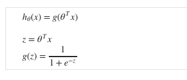
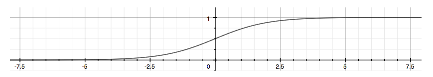

# Week 3

## Classification and Representation

### Classification

The classification problem is just like the regression problem, except that the values we now want to predict take on only a small number of discrete values.

For instance, if we are trying to build a spam classifier for email, then x(i) may be some features of a piece of email, and y may be 1 if it is a piece of spam mail, and 0 otherwise. 
Hence, y∈{0,1}. 0 is also called the negative class, and 1 the positive class, and they are sometimes also denoted by the symbols “-” and “+.” 
Given x(i),the corresponding y(i) is also called the label for the training example.

### Hypothesis Representation

We could approach the classification problem ignoring the fact that y is discrete-valued, and use our old linear regression algorithm to try to predict y given x. 
However, it is easy to construct examples where this method performs very poorly. 
Intuitively, it also doesn’t make sense for hθ(x) to take values larger than 1 or smaller than 0 when we know that y ∈ {0, 1}. 
To fix this, let’s change the form for our hypotheses hθ(x) to satisfy <b> 0 <= hθ(x) <= 10 </b>.
This is accomplished by plugging θTx into the Logistic Function.

Our new form uses the "Sigmoid Function," also called the "Logistic Function":

The following image shows us what the sigmoid function looks like:

The function g(z), shown here, maps any real number to the (0, 1) interval, 
making it useful for transforming an arbitrary-valued function into a function better suited for classification.

<b> hθ(x) will give us the probability that our output is 1. </b>. 
For example, hθ(x) = 0.7 gives us a probability of 70% that our output is 1. 
Our probability that our prediction is 0 is just the complement of our probability that it is 1 
(e.g. if probability that it is 1 is 70%, then the probability that it is 0 is 30%).

### Decision Boundary

In order to get our discrete 0 or 1 classification, we can translate the output of the hypothesis function as follows:

> hθ(x)  >= 0.5 then y = 1
> 
> hθ(x)  < 0.5 then y = 0

The way our logistic function g behaves is that when its input is greater than or equal to zero, its output is greater than or equal to 0.5:

> g(z) >= 0.5 when z >= 0 

Remember:

> z = 0, e0 = 1 then g(z) = 1/2
> 
> z tordards ∞, e-∞ then g(z) = 1
> 
> z tordards -∞, e∞ then g(z) = 0

<b>The decision boundary is the line that separates the area where y = 0 and where y = 1.</b> It is created by our hypothesis function.

