# Neural Networks: Representation

## Neural Networks

### Model Representation I

Let's examine how we will represent a hypothesis function using neural networks. At a very simple level, neurons are basically computational units that take inputs (<b>dendrites</b>) as electrical inputs (called "spikes") that are channeled to outputs (<b>axons</b>). In our model, our dendrites are like the input features x1 ... xn, and the output is the result of our hypothesis function. In this model our x0 input node is sometimes called the "bias unit." It is always equal to 1. In neural networks, we use the same logistic function as in classification, 1 / ( 1 + e ^ (θTx) ) yet we sometimes call it a sigmoid (logistic) <b>activation</b> function. In this situation, our "theta" parameters are sometimes called "weights".

Visually, a simplistic representation looks like:

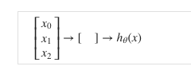

Our input nodes (layer 1), also known as the "input layer", go into another node (layer 2), which finally outputs the hypothesis function, known as the "output layer".

We can have intermediate layers of nodes between the input and output layers called the "hidden layers."

In this example, we label these intermediate or "hidden" layer nodes a02 ... an2 and call them "activation units."

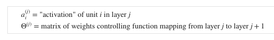

If we had one hidden layer, it would look like:

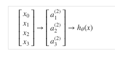

The values for each of the "activation" nodes is obtained as follows:

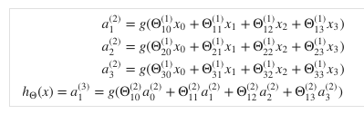

This is saying that we compute our activation nodes by using a 3×4 matrix of parameters. We apply each row of the parameters to our inputs to obtain the value for one activation node. Our hypothesis output is the logistic function applied to the sum of the values of our activation nodes, which have been multiplied by yet another parameter matrix θ(2) containing the weights for our second layer of nodes.

Each layer gets its own matrix of weights, θ(j).

The dimensions of these matrices of weights is determined as follows:

If network has <i>sj</i> units in layer <i>j</i> and <i>sj+1</i> units in layer j+1, then θ(j) will be of dimension <i>sj+1</i> X (<i>sj</i> + 1)

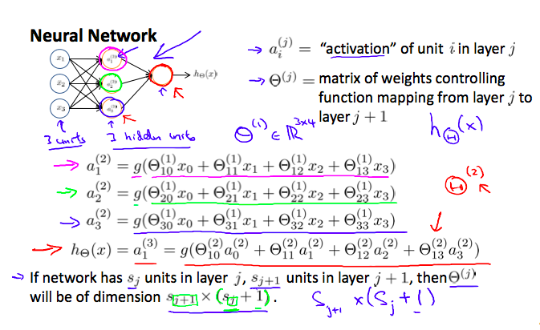

### Model Representation II

To re-iterate, the following is an example of a neural network:

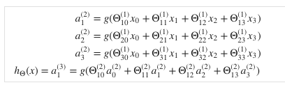

In this section we'll do a vectorized implementation of the above functions. We're going to define a new variable zk(j) that encompasses the parameters inside our g function. In our previous example if we replaced by the variable z for all the parameters we would get:

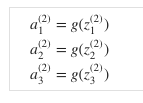

In other words, for layer j=2 and node k, the variable z will be:

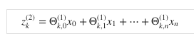

The vector representation of x and zj is:

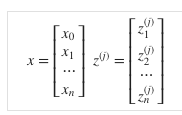

Setting x = a(1), we can rewrite the equation as:

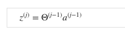

We are multiplying our matrix Θ(j−1) with dimensions sj X (n+1)s (where sj is the number of our activation nodes) by our vector a(j−1) with height (n+1). This gives us our vector z(j) with height sj.
Now we can get a vector of our activation nodes for layer j as follows:

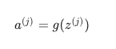

Where our function g can be applied element-wise to our vector z(j).

We can then add a bias unit (equal to 1) to layer j after we have computed a(j). This will be element a0(j) and will be equal to 1. To compute our final hypothesis, let's first compute another z vector:

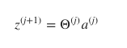

We get this final z vector by multiplying the next theta matrix after Θ(j−1) with the values of all the activation nodes we just got. This last theta matrix Θ(j) will have only <b>one row</b> which is multiplied by one column a(j) so that our result is a single number. We then get our final result with:

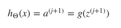

Notice that in this <b>last step</b>, between layer j and layer j+1, we are doing <b>exactly the same thing</b> as we did in logistic regression. 
Adding all these intermediate layers in neural networks allows us to more elegantly produce interesting and more complex non-linear hypotheses.