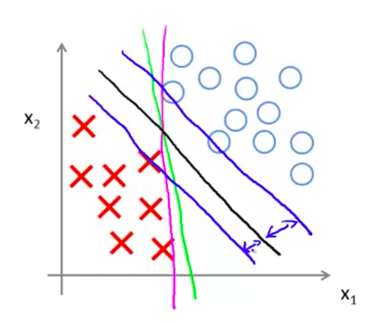

# Support Vector Machines

## Large Margin Classification
### Optimization Objective
#### Alternative view of logistic regression
We're gonna start with logistic regression, and show how we can modify it a bit, and get what is essentially the support vector machine.

Let z = Θ<sup>T</sup>x.

In sigmoid function, we hope:

- If y = 1, we want h<sub>Θ</sub>(x) close to 1 and then Θ<sup>T</sup>x >> 0.
- If y = 0, we want h<sub>Θ</sub>(x) close to 0 and then Θ<sup>T</sup>x << 0.

If we look at the cost function of the logistic regression:
```
-1 *  (y * log h<sub>Θ</sub>(x) + (1 - y) log (1 - h<sub>Θ</sub>(x)))) 
# que é igual a:
y log sigmoid(Θ<sup>T</sup>x) - (1 - y) log (1 - Θ<sup>T</sup>x)
```

So each example (x, y) contributes a term like the expression above for the overall cost function.

For the SVM we are going to take this cost function and modify it a little bit:


Now we have a flat portion and the straight line portion and this will give the SVM computational advantages to us.

We''do the same for y = 0:


We'll name it cost<sub>1</sub>(z) when y = 1 and cost<sub>0</sub>(z) when y = 0.

Here's the const function for logistic regression:


and replace it with our new cost functions, this will give us the **SVM hypothesis**:


and h<sub>Θ</sub>(x) = 1 if Θ<sup>T</sup>x >> 0, or 0 otherwise.


### Large Margin Intuition

The SVM is know as large marge classifiers. The idea of the algorithm is to choose the path (or the function) that gives us the larger margin possible as show:




## Kernels
We're gonna adapt the SVM in order to develop complex nonlinear classifiers and the main technique for doing that is called **kernels**.

if  we have a decision boundary like this:


We in the past choose a polynomial that would fit this figure, but we've seen that the number of features growth is exponential, using it as follows:


Θ<sub>0</sub> + Θ<sub>1</sub>f<sub>1</sub> + Θ<sub>2</sub>f<sub>2</sub> + ....
where f<sub>1</sub> = x<sub>1</sub>, f<sub>2</sub> = x<sub>2</sub>, f<sub>3</sub> = x<sub>1</sub>x<sub>2</sub>, f<sub>4</sub> = x<sub>1</sub><sup>2</sup>, f<sub>5</sub> = x<sub>2</sub><sup>2</sup>, ....

We instead decide the functions with kernels.

Given x, compute new feature depending on proximity to landmarks l<sup>(1)</sup>, l<sup>(2)</sup>, l<sup>(3)</sup>. As shown in the image below:


We'll calculate the similarity between the landmark and x and associate to the functions:


these similarity functions are called **Gaussian Kernels**

If x is close to l<sup>(1)</sup> then f<sub>1</sub> will be close to 1, on the other side if x is far from l<sup>(1)</sup> then f<sub>1</sub> will be close to 0.

#### Variations in sigma

The image shows the variations in sigma


#### Where to get the landmarks?

We'll put each landmark at the same location of the training examples. So for a given training set: 

(x<sup>(1)</sup>, y<sup>(1)</sup>), (x<sup>(2)</sup>, y<sup>(2)</sup>), ..., (x<sup>(m)</sup>, y<sup>(m)</sup>), we choose  *l*<sup>(1)</sup> = x<sup>(1)</sup>, *l*<sup>(2)</sup> = x<sup>(2)</sup>, ..., *l*<sup>(m)</sup> = x<sup>(m)</sup>.

And we calculate the kernels and then we'll have something like:


## SVMs in Practice