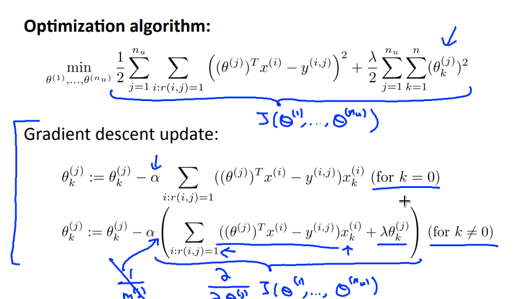
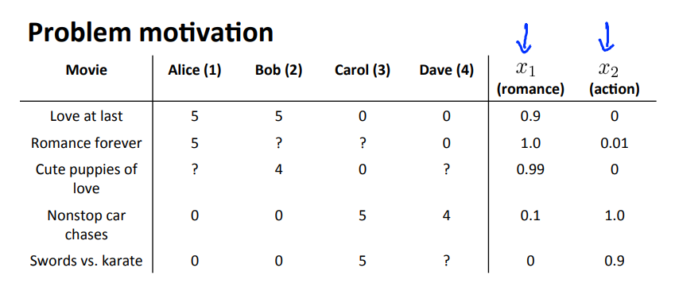
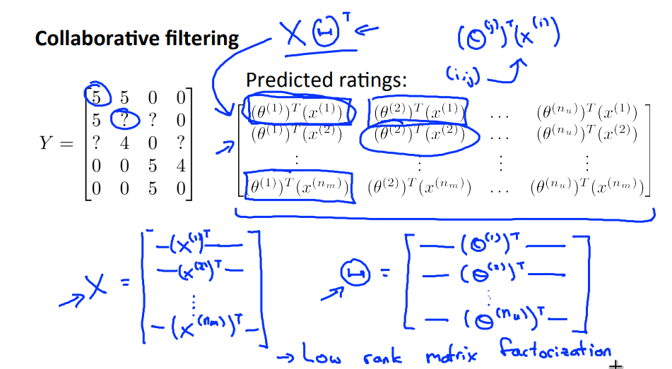

# Anomaly Detection
## Density Estimation
### Problem Motivation

Let's say that on, the next day, you have a new aircraft engine that rolls off the assembly line and your new aircraft engine has some set of features xtest. What the anomaly detection problem is, we want to know if this aircraft engine is anomalous in any way, in other words, we want to know if, maybe, this engine should undergo further testing because, or if it looks like an okay engine, and so it's okay to just ship it to a customer without further testing.

So we have a new example in which x1 and x2 are the features of this new example. If our test features are all the way out there, then we would call that an anomaly, and maybe send that aircraft engine for further testing before we ship it to a customer, since it looks very different than the rest of the aircraft engines we've seen before.

More formally in the anomaly detection problem, we're give some data sets, {x1, ..., Xm} of examples, and we usually assume that these end examples are normal or non-anomalous examples, and we want an algorithm to tell us if some new example xtest is anomalous. The approach that we're going to take is that given this training set, given the unlabeled training set, we're going to build a model for P(x).
And so, having built a model of the probability of x we're then going to say that for the new aircraft engine, if:

**P(xtest) < epsilon**

then we flag this as an anomaly.

#### Applications
* Fraud detection
* Manufacturing
* Monitor computers in data center

### Gaussian Distribution
Also called the normal distribution. 

And the Gaussian distribution is parametarized by two parameters, by a mean parameter which we denote µ and a variance parameter which we denote via σ2. If we plot the Gaussian distribution or Gaussian probability density. It'll look like the bell shaped curve which you may have seen before.

And so this bell shaped curve is parametrized by those two parameters, µ and σ2. And the location of the center of this bell shaped curve is the mean mu. And the width of this bell shaped curve, roughly that, is this parameter, sigma, is also called one standard deviation, and so this specifies the probability of x taking on different values.
The probability density of the normal distribution is:

### Algorithm
Given the training set {x(1), ... , x(m)}. Each example x ∈ **R**n.

P(x) = P(x1; µ1, σ12) * P(x2; µ2, σ22) * ... * P(xn; µn, σn2)

We can prove that all features xk, k **c** [1, n] are independent.

## Building an Anomaly Detection System
### Developing and Evaluating an Anomaly Detection System
Given the training cross validation and test sets, here's how you evaluate or here is how you develop and evaluate an algorithm.

Fit model P(x) on training set {x(1), ... , x(m)}

On a cross-validation/test example x, predict: 

y = 1 if P(x) < ε (anomaly) or 0 if P(x) >= ε (normal) 

Possible evaluation metrics: 
* True positive, false positive, false negative, true negative
* Precision/recall
* F1-score
### Anomaly Detection vs. Supervised Learning 
#### Anomaly Detection
We use more anomaly detection, with:
* Very smal number of positive examples
* Large number of negative examples
* Many different types of anomalies. Hard for any algorithm to learn from positive examples what the anormalies look like
* Future anomalies may look nothing like any anomalous example so far
* Examples:
	* Fraud detection
	* Manufacturing
	* Monitoring machines in a data center

#### Supervised Learning
We use supervised learning with:
* Large number of positive examples
* Enough positive examples for algorithm to get a sense of what positive examples are like, future positive examples likely to be similar to ones in the training set
* Examples:
	* Email spam classifier
	* Weather prediction
	* Cancer classification
### Choosing What Features to Use 
We may want to test a few times, combine some features of transform features in order the algorithm better.

## Multivariate Gaussian Distribution (Optional)
### Multivariate Gaussian Distribution

In multivariate Gaussian instead of model P(x) = P(x1) * P(x2) * ... * P(xn) separately, we will model P(x) all in on go.

Paratemeters:
* µ ∈ **R**n, where µ = 1 / m * Σi=1 to m x(i)
* Σ (covariance matrix), where Σ = 1 / m * Σi=1 to m (x(i) - µ)(x(i) - µ)T

P(x; µ, Σ) = [ (2π)n/2 |Σ|1/2 ]-1 * exp[ -1/2 (x - µ)T Σ-1 (x - µ) ]

### Anomaly Detection using the Multivariate Gaussian Distribution

And we flag an anomaly if P(x; µ, Σ) < ε

#### Original Model vs. Multivariate
##### Original Model
P(x1; µ1, σ12) * P(x2; µ2, σ22) * ... * P(xn; µn, σn2)

* Manually creates features to capture anomalies where x1, x2 take unusual combinations of values (e.g cpu load / memory)
* Computationaly cheaper (scales better)
* Okay even if *m*(training set size) is small 
##### Muiltivariate Gaussian
P(x; µ, Σ) = [ (2π)n/2 |Σ|1/2 ]-1 * exp[ -1/2 (x - µ)T Σ-1 (x - µ) ]

* Automatically captures correlation between features
* Computationally more expensive
* Must have m > n or else Σ is non-invertible

# Recommender Systems
## Predicting Movie Ratings
### Problem Formulation
The idea of a recommender system is to give the best choice possible, given the movies you've liked. 

Notations: 
* nu = number of users
* nm = number of movies
* r(i, j) = 1 if the user *j* has rated movie *i*
* y(i, j) = rating given by user *j* to movie *i* (defined onlyl if r(i, j) =1 )

### Content Based Recommendations

We want to predict the movies that was not rated by the users, so each movie will have a set of features correspondent to it, giving information about genre, actors, etc.

For each user *j*, learn a parameter θ(j) ∈ **R**n. Predict user *j* as rating movie *i* with  (θ(j))Tx(i) stars.

Where θ(j) is the parameter vector for user *j* and m(y) the number of movies rated by user *j*.

#### Optimization objective

To learn θ(j) (parameter for user *j*):

min 1/2 * Σi:r(i, j)=1 [ (θ(j))Tx(i) - y(i, j) ]2 + λ/2 * Σk=1..n [ θk(j) ]2

To learn θ(1), θ(2), ... , θ(nu):

min 1/2 * Σj=1..nu Σi:r(i, j)=1 [ (θ(j))Tx(i) - y(i, j) ]2 + λ/2 * Σj=1..nu  Σk=1..n [ θk(j) ]2

 
## Collaborative Filtering
### Collaborative Filtering

We have a list of features to each movie and the ratings for the user for each movie, collaborative filtering makes one user rating improves the whole algorithm.

Previously we viewed that given x(1), ... , x(nm) we can learn θ(1), ... , θ(nu)

So we can use  θ(1), ... , θ(nu) to improve the features x(1), ... , x(nm).

And we can starting looping and improving thetas and x's at the same time.

### Algorithm
Minimizing x(1), ... , x(nm) and θ(1), ... , θ(nu) simultaneously:

J(x(1), ... , x(nm), θ(1), ... , θ(nu)) = 1/2 * Σj=1..nu Σi:r(i, j)=1 [ (θ(j))Tx(i) - y(i, j) ]2 + λ/2 * Σj=1..nu  Σk=1..n [ θk(j) ]2  + λ/2 * Σi=1..nm  Σk=1..n [ xk(i) ]2

1. Initialize x(1), ... , x(nm), θ(1), ... , θ(nu) to small random values.
2. Minimize J(x(1), ... , x(nm), θ(1), ... , θ(nu)) using gradient descent (or an advanced optimization algorithm). E.g. for every j = 1, ... , nu and i = 1, ... , nm:

xk(i) := xk(i) - α [ Σj:r(i, j)=1 ( (θ(j))Tx(i) - y(i, j) ) θk(j) + λ xk(i) ]

θk(j) := θk(j) - α [ Σi:r(i, j)=1 ( (θ(j))Tx(i) - y(i, j) ) θk(i) + λ xk(j) ]

3. For a user with parameters θ and a movie with (learned) features x, predict a star rating of θTx

## Low Rank Matrix Factorization
### Vectorization: Low Rank Matrix Factorization

#### Finding related movies
We can find related movies by using the vector of features x(i), if || x(i) - x(j) || is small we can conclude that movie *i* and *j* are related.

### Implementational Detail: Mean Normalization

To motivate the idea of mean normalization, let's consider an example of where there's a user that has not rated any movies. So the θ of the user will be all 0's and if we multiply by x(i) for any movie we will have predicted rating equal 0.

So to correct this implementation error we use mean normalization:

 (θ(j))Tx(i) + μi
