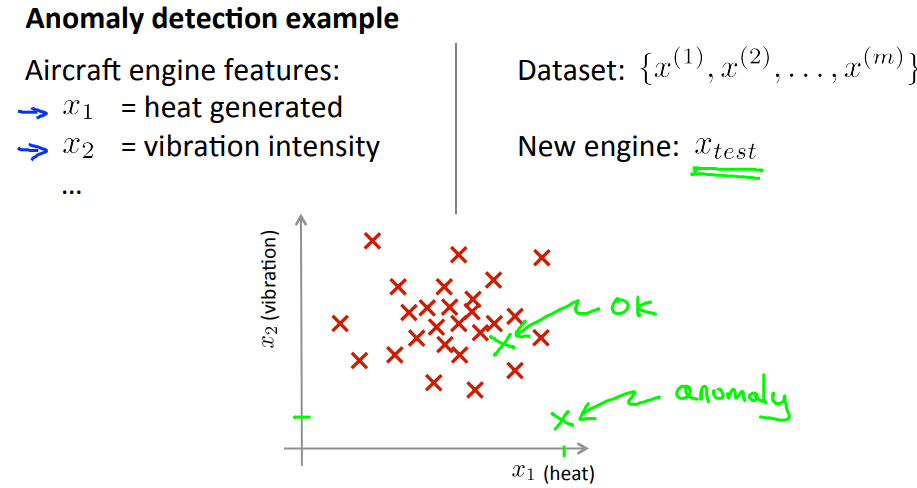
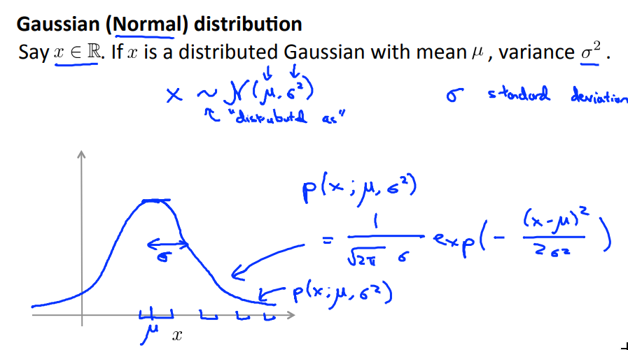
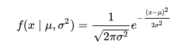
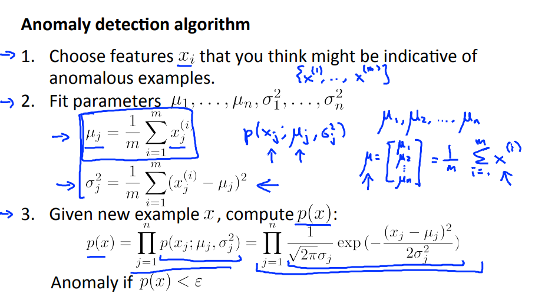

# Anomaly Detection
## Density Estimation
### Problem Motivation

Let's say that on, the next day, you have a new aircraft engine that rolls off the assembly line and your new aircraft engine has some set of features xtest. What the anomaly detection problem is, we want to know if this aircraft engine is anomalous in any way, in other words, we want to know if, maybe, this engine should undergo further testing because, or if it looks like an okay engine, and so it's okay to just ship it to a customer without further testing.

So we have a new example in which x1 and x2 are the features of this new example. If our test features are all the way out there, then we would call that an anomaly, and maybe send that aircraft engine for further testing before we ship it to a customer, since it looks very different than the rest of the aircraft engines we've seen before.

More formally in the anomaly detection problem, we're give some data sets, {x1, ..., Xm} of examples, and we usually assume that these end examples are normal or non-anomalous examples, and we want an algorithm to tell us if some new example xtest is anomalous. The approach that we're going to take is that given this training set, given the unlabeled training set, we're going to build a model for P(x).
And so, having built a model of the probability of x we're then going to say that for the new aircraft engine, if:

**P(xtest) < epsilon**

then we flag this as an anomaly.

#### Applications
* Fraud detection
* Manufacturing
* Monitor computers in data center

### Gaussian Distribution
Also called the normal distribution. 

And the Gaussian distribution is parametarized by two parameters, by a mean parameter which we denote µ and a variance parameter which we denote via σ2. If we plot the Gaussian distribution or Gaussian probability density. It'll look like the bell shaped curve which you may have seen before.

And so this bell shaped curve is parametrized by those two parameters, µ and σ2. And the location of the center of this bell shaped curve is the mean mu. And the width of this bell shaped curve, roughly that, is this parameter, sigma, is also called one standard deviation, and so this specifies the probability of x taking on different values.
The probability density of the normal distribution is:

### Algorithm
Given the training set {x(1), ... , x(m)}. Each example x ∈ **R**n.

P(x) = P(x1; µ1, σ12) * P(x2; µ2, σ22) * ... * P(xn; µn, σn2)

We can prove that all features xk, k **c** [1, n] are independent.

## Building an Anomaly Detection System
## Multivariate Gaussian Distribution (Optional)

# Recommender Systems
## Predicting Movie Ratings
## Collaborative Filtering
## Low Rank Matrix Factorization
